# nd_manage_switches Design Document

## 1. Purpose and Scope

This document describes the architecture, state flows, and operational handling of the `nd_manage_switches` module implementation across:

- `plugins/modules/nd_manage_switches.py`
- `plugins/module_utils/nd_switch_resources_v2.py`
- `plugins/module_utils/switch_utils.py`

The design covers:

- Entry-point orchestration and error boundaries
- State dispatch and specialized operation routing (normal, POAP, RMA)
- Diffing and reconciliation behavior (`merged`, `overridden`, `deleted`, `query`)
- Wait/retry orchestration for switch readiness
- Result registration and output shaping

---

## 2. High-Level Architecture

### 2.1 Layered View

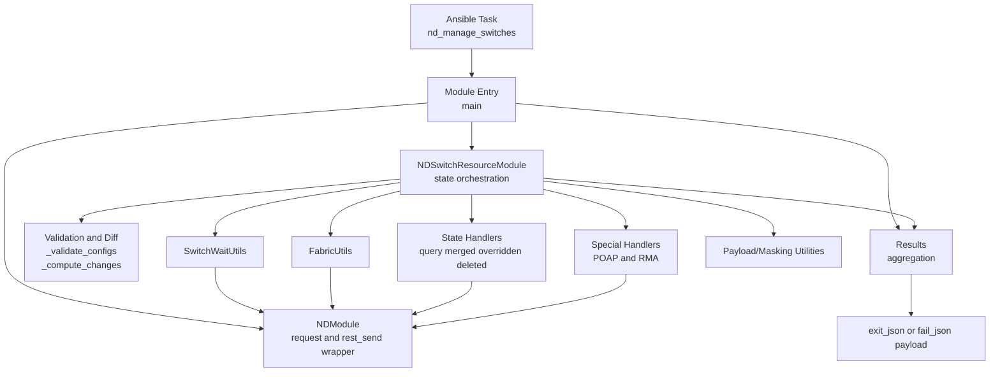

### 2.2 Component Responsibilities

- `nd_manage_switches.py` (module entry):
  - Defines Ansible argument spec and module behavior (`supports_check_mode`, `required_if`).
  - Initializes logging, `NDModule`, `Results`, and `NDSwitchResourceModule`.
  - Executes `manage_state()` and emits final result through `exit_json()`.
  - Captures both `NDModuleError` and generic exceptions with structured failure output.

- `NDSwitchResourceModule` (core orchestrator):
  - Owns state-machine dispatch.
  - Performs config validation, discovery-to-model transformation, diff categorization.
  - Executes state handlers and specialized POAP/RMA workflows.
  - Coordinates post-change lifecycle operations (manageability wait, credential save, save/deploy fabric config).

- `switch_utils.py`:
  - `FabricUtils`: save/deploy/get fabric info with centralized request error handling.
  - `SwitchWaitUtils`: multi-phase readiness sequencing (migration->normal->discovery states).
  - `PayloadUtils`: small payload construction helpers (simple dict payloads).

---

## 3. Runtime Data Flow

### 3.1 End-to-End Request Flow

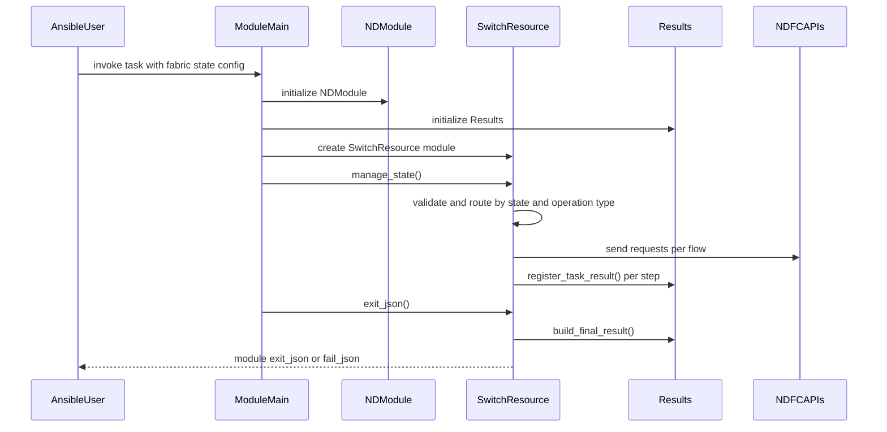

### 3.2 Result Model Handling

`Results` is updated incrementally after each API step (`discover`, `create`, `delete`, `bootstrap`, `preprovision`, `rma`, credential save, etc.). Final output includes:

- aggregated task results
- operation logs (`nd_logs`)
- `previous` and `current` switch snapshots

This produces a composable, multi-step response instead of a single monolithic status.

### 3.3 Critical Nuance: Add-Switch Payload Synthesis (Playbook + Discovery)

Before switches can be added to fabric, the module intentionally combines two different data sources:

1. User intent from playbook config (`seed_ip`, `role`, credentials, preserve policy).
2. Runtime controller discovery data (for example `serialNumber`, `hostname`, `ip`, `model`, discovered software attributes).

This merge is mandatory because add-switch API payloads require controller-observed identity fields that may not be fully or reliably present in user input.

#### Why this exists

- Playbook config carries intent and policy.
- Discovery response carries authoritative device identity/shape.
- Add payload requires both dimensions to avoid malformed or ambiguous onboarding requests.

#### Where this happens in code

- Grouping input by shared credentials: `_group_switches_by_credentials`
- Bulk discovery by credential group: `_discover_switches` -> `_bulk_discover_switches`
- Proposed model build and diffing: `_build_proposed_from_discovery`, `_compute_changes`
- Final add payload assembly: `_bulk_add_switches_to_fabric`

#### Add payload synthesis flow

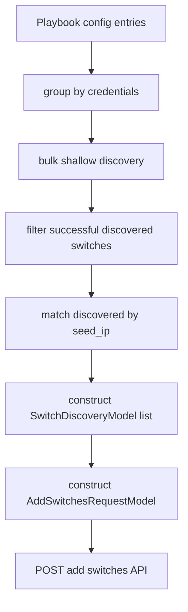

#### Data mapping summary (conceptual)

| Payload field class | Source of truth |
|---|---|
| credentials/auth policy | playbook config |
| preserve policy | playbook config |
| role intent | playbook config |
| serial number / hostname / discovered identity | discovery response |
| final add request envelope | synthesized by schema model (`AddSwitchesRequestModel`) |


### 3.4 Full Lifecycle: From Playbook Execution to Final Output

This is the complete module lifecycle a user experiences after invoking the playbook task.

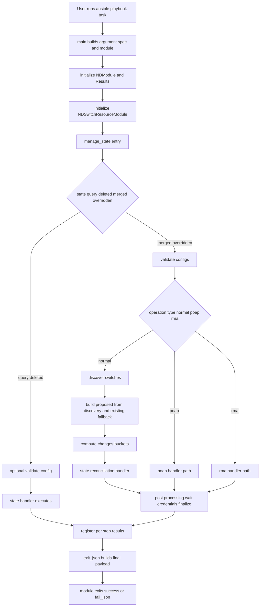

#### Step-by-step narrative

1. Ansible invokes `nd_manage_switches.main()` with module args.
2. Module initializes logging, `NDModule`, and `Results` aggregator.
3. `NDSwitchResourceModule` is created and loads current fabric inventory context.
4. `manage_state()` routes execution by state and (for merged/overridden) operation type.
5. For normal reconciliation flows:
   - validate input schema
   - discover devices
   - build proposed switch models
   - compute diff buckets (`to_add`, `to_update`, `to_delete`, `migration_mode`, `idempotent`)
   - apply state semantics (merged/overridden)
6. For POAP/RMA flows, module bypasses normal diff pipeline and runs specialized handlers.
7. Post-change lifecycle runs as applicable:
   - wait for manageability transitions
   - save credentials in grouped calls
   - save/deploy fabric config based on flags
8. Each major API step registers a structured task result in `Results`.
9. `exit_json()` composes final result with logs, previous/current snapshots, and aggregated responses.
10. Module returns success or structured failure payload.

---

## 4. State Machine and Routing

### 4.1 Top-Level Routing (`manage_state`)

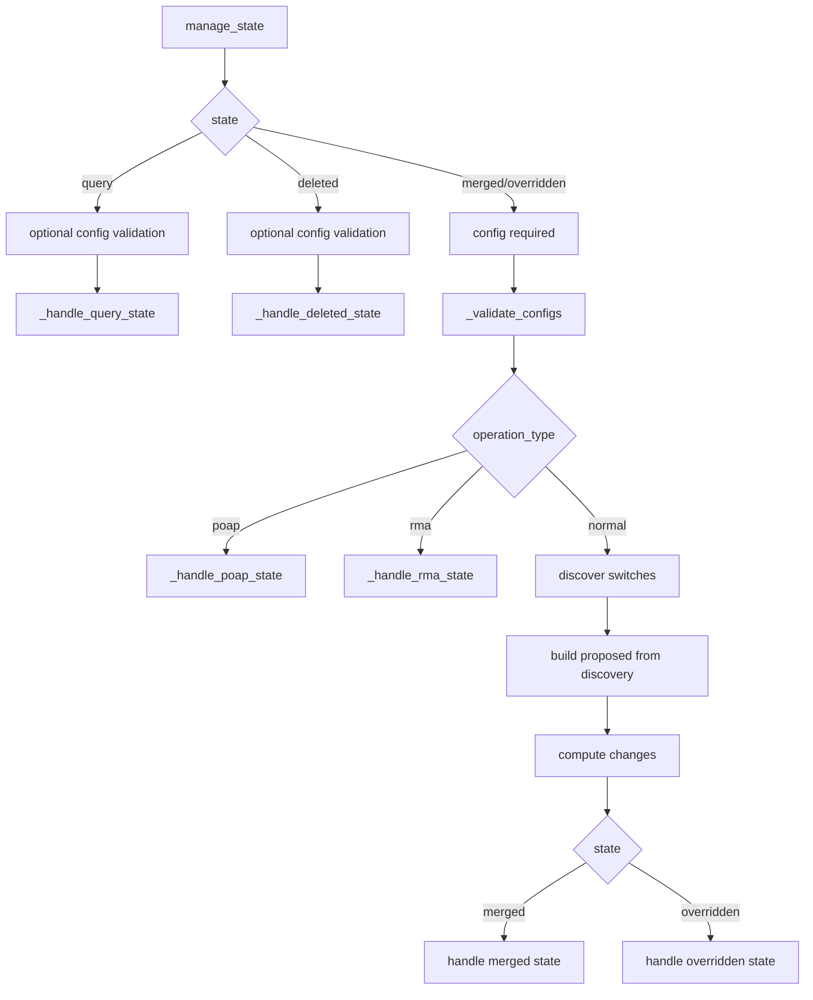

### 4.2 Operational Modes

- Normal mode:
  - Discovery + compare + reconcile.
- POAP mode:
  - Bypasses normal discovery pipeline and runs bootstrap/preprovision workflow.
- RMA mode:
  - Bypasses normal discovery pipeline and runs replacement workflow with prerequisite enforcement.

---

## 5. Diff and Reconciliation Design

### 5.1 Diff Categories (`_compute_changes`)

`_compute_changes` classifies into:

- `to_add`: proposed not found by switch ID nor by management IP
- `to_update`: controllable fields differ between proposed and existing
- `to_delete`: existing not present in proposed set
- `migration_mode`: existing switch currently in Migration mode
- `idempotent`: no effective change

Comparison intentionally limits to user-controlled fields:

- `switch_id`, `serial_number`, `fabric_management_ip`, `hostname`, `model`, `software_version`, `switch_role`

This avoids false positives from controller-managed telemetry/state fields.

### 5.2 Merge vs Override Semantics

- `merged`:
  - Adds `to_add`
  - Processes `migration_mode`
  - Warns on `to_update` (not applied in merged)

- `overridden`:
  - Deletes `to_delete`
  - Converts `to_update` into delete-and-readd
  - Delegates add/migration processing to merged handler

- `deleted`:
  - Deletes all if no config
  - Otherwise deletes exact matches by seed IP

- `query`:
  - Returns all switches if no config
  - Otherwise filters by seed IP and optional role

---

## 6. Detailed State Flow Handling

## 6.1 Query

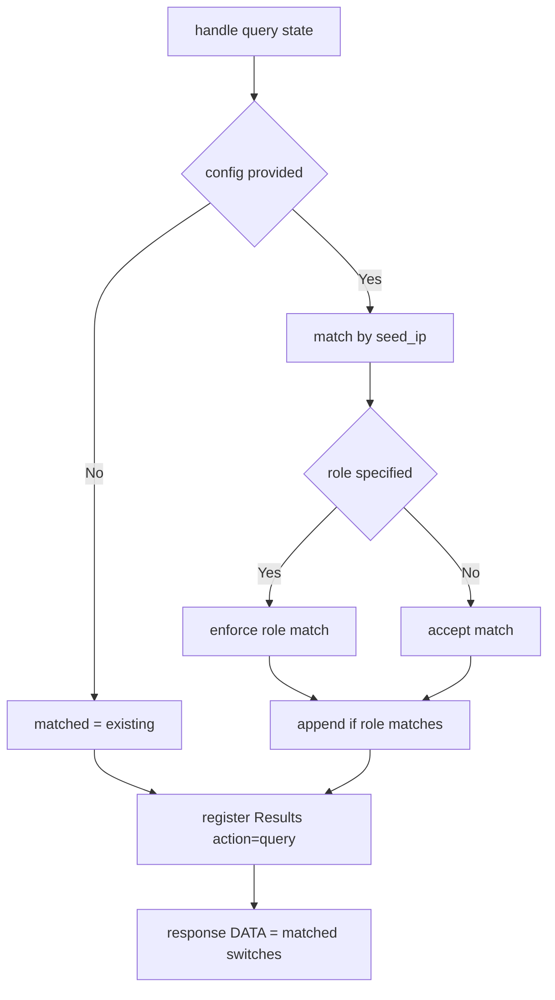

Behavior:

- No mutation calls.
- Registers one result item with `RETURN_CODE=200`, `found`, and payload list.

## 6.2 Deleted

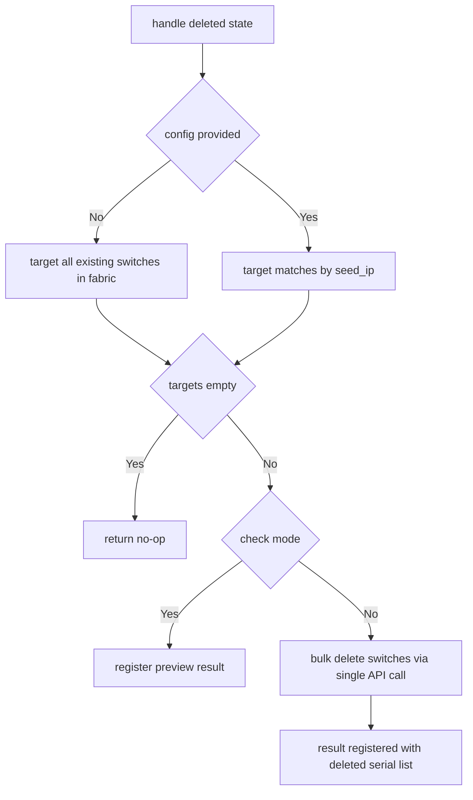

#### Delete-all behavior (no config)

When `state: deleted` is used **without** a `config` block, the module deletes **every switch currently in the fabric**. This is a deliberate design decision that mirrors the legacy `dcnm_inventory` module.

```yaml
# This deletes ALL switches from AK-VXLAN
- name: Wipe fabric switches
  cisco.nd.nd_manage_switches:
    fabric: AK-VXLAN
    state: deleted
```

**How it works end-to-end**:

1. **Argument spec**: `config` is only required for `merged`/`overridden` states (`required_if`). For `deleted`, Ansible passes `None` when `config` is omitted.
2. **`__init__`**: `self.existing` is populated from `_query_all_switches()` at construction — this is the full fabric inventory at the time the module starts.
3. **`manage_state`**: The `if self.config` check evaluates to `False` for `None` or `{}`, so `proposed_config` is set to `None`.
4. **`_handle_deleted_state(None)`**: The `if proposed_config is None` branch sets `switches_to_delete = list(self.existing)`, targeting every switch.
5. **`_bulk_delete_switches`**: Collects all `switch_id` / `serial_number` values and sends a single `POST` to the remove endpoint with `{"switchIds": [...]}`.

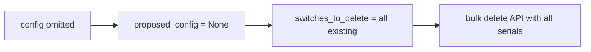

#### Selective delete (with config)

When `config` **is** provided, only switches whose `seed_ip` matches an existing switch's `fabric_management_ip` are targeted:

```yaml
# This deletes ONLY the specified switch
- name: Remove one switch
  cisco.nd.nd_manage_switches:
    fabric: AK-VXLAN
    state: deleted
    config:
      - seed_ip: 10.122.84.59
```

Switches in the config that do not match any existing inventory entry are silently skipped (logged as "Switch not found for deletion").

#### Edge cases

| Scenario | Behavior |
|---|---|
| No config, empty fabric | `switches_to_delete` is empty → no-op return |
| Config with non-existent seed_ip | That entry is skipped; other matches proceed |
| Check mode (either path) | Preview result registered; no API call made |

## 6.3 Merged

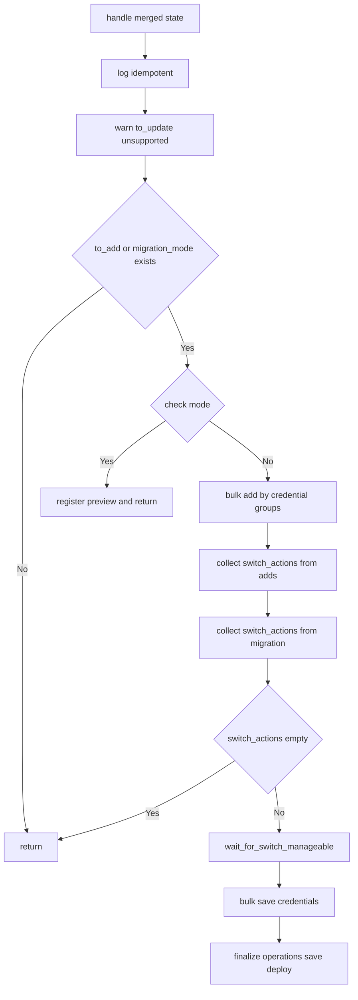

## 6.4 Overridden

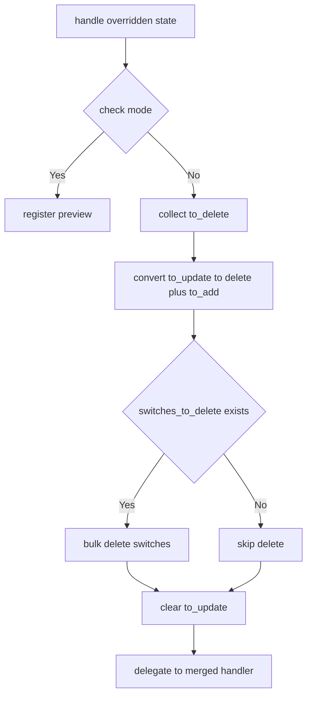

---

## 7. POAP and RMA Specialized Flows

## 7.1 POAP Flow

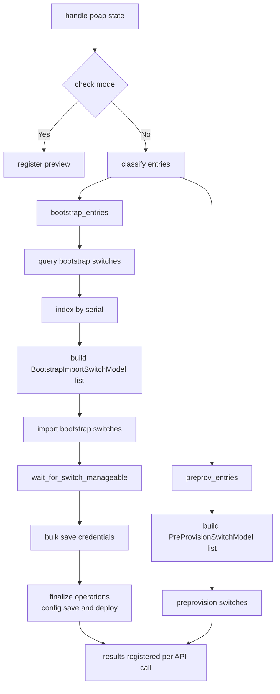

Notable handling:

- Bootstrap requires serial to be present in bootstrap API response; otherwise fail-fast with actionable message.
- After bootstrap import, switches boot/reload just like normal switch imports. The handler runs the same post-processing lifecycle: wait for manageability → save credentials → config-save + config-deploy.
- **POAP bootstrap always causes a device reboot** regardless of the fabric's greenfield debug flag (`GRFIELD_DEBUG_FLAG`). The wait call passes `skip_greenfield_check=True` to bypass the greenfield shortcut and ensure full reload detection (phases 5-6) is always executed.
- Pre-provision does not require bootstrap lookup and does **not** need post-processing — the switch does not physically exist yet.

## 7.2 RMA Flow

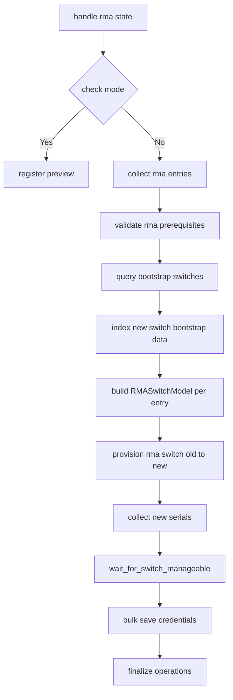

RMA prerequisites enforced before provisioning:

- old serial exists in current fabric inventory
- old switch discovery status is `unreachable`
- old switch system mode is `maintenance`

---

## 8. Wait and Readiness Handling (`SwitchWaitUtils`)

`wait_for_switch_manageable(serials, all_preserve_config=False, skip_greenfield_check=False)` executes a multi-phase progression:

1. Wait for system mode transition out of `migration`.
2. Wait for system mode to enter `normal`.
3. **Brownfield short-circuit**: If `all_preserve_config=True`, return success immediately — brownfield switches keep their running config and never reload, so phases 5-6 are unnecessary.
4. If greenfield debug flag enabled in fabric settings **and** `skip_greenfield_check` is `False`, short-circuit success.
5. Wait for discovery status to become `unreachable` (expected reload/intermediate behavior).
6. Trigger rediscovery and wait for discovery status `ok`.

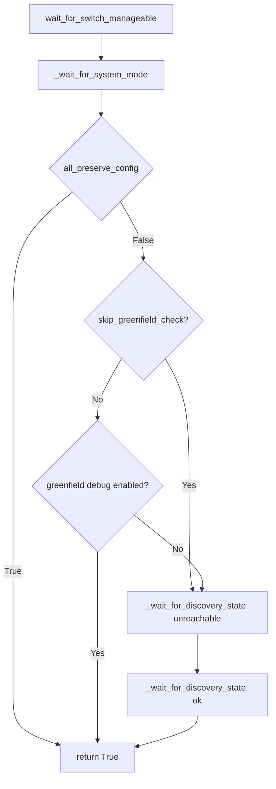

### 8.1 Brownfield `preserve_config` Optimisation

When every switch in the batch has `preserve_config=True` (brownfield deployment), the switches retain their existing configuration and **do not reload** after being added to the fabric. Without this optimisation, the wait utility would poll for an `unreachable` discovery status that never arrives, causing a ~25-minute timeout (300 attempts x 5 seconds).

This mirrors the `all_brownfield_switches` logic in the legacy `dcnm_inventory` module:

| Scenario | Legacy (`dcnm_inventory`) | New (`SwitchWaitUtils`) |
|---|---|---|
| All brownfield | Skips entire wait loop | Completes phases 1-2, skips 5-6 |
| Mixed or all greenfield | Full wait loop | Full 6-phase progression |
| Greenfield debug flag | Checked inside `ready_to_continue()` | Phase 4 short-circuit |
| POAP bootstrap | N/A (separate code path) | `skip_greenfield_check=True` — always runs phases 5-6 |

The `all_preserve_config` flag is computed in the orchestrator (`_handle_merged_state`):

```python
all_preserve_config = all(cfg.preserve_config for _, cfg in switch_actions)
```

> **Note**: RMA operations always require full reload detection (the replacement switch must boot fresh), so `_handle_rma_state` does **not** pass `all_preserve_config`.
>
> **Note**: POAP bootstrap imports always reboot the device regardless of the fabric's greenfield debug flag setting. The POAP handler passes `skip_greenfield_check=True` to ensure the wait utility always runs the full reload detection sequence (phases 5-6).

Design characteristics:

- Explicit retry loops with configurable attempts and interval.
- Dedicated status sets for manageable/in-progress/failed states.
- API failures are logged and converted to boolean outcomes for orchestrator decisions.
- Brownfield batches avoid unnecessary 25-minute timeout via early return after system mode normalisation.

---

## 9. Error Handling Strategy

## 9.1 Entry-Point Boundaries (`main`)

- `NDModuleError` path:
  - Pulls `rest_send` response/result where available.
  - Falls back to synthetic response if unavailable.
  - Registers failed result and fails module with structured payload.

- Generic `Exception` path:
  - Captures unexpected exceptions into `RETURN_CODE=-1` response.
  - Optionally appends traceback for debug output level.

## 9.2 In-Orchestrator Fail-Fast Patterns

`NDSwitchResourceModule` uses direct `module.fail_json` for non-recoverable semantic issues, such as:

- missing required config for state
- unsupported state
- discovery/inventory mismatch when building proposed model
- missing bootstrap serial for POAP/RMA
- RMA prerequisite violations

## 9.3 Recoverable vs Best-Effort

- Role update and credential save operations are best-effort in certain branches (warnings logged).
- Manageability wait failures currently warn but do not always abort merged/RMA completion flow.

---

## 10. Check Mode Behavior

State handlers implement explicit preview behavior:

- `query`: naturally read-only
- `deleted`: reports target list, no mutation request
- `merged`: reports to_add/migration candidate lists
- `overridden`: reports to_delete/to_update/to_add/migration counts
- `poap`/`rma`: preview response with intended seed IP list

This keeps deterministic intent visibility while preventing API mutations.

---

## 11. Security and Observability

## 11.1 Secret Handling

- Password fields are marked `no_log` at Ansible argument level.
- `_mask_password` recursively masks password-bearing keys before debug logging payloads.

## 11.2 Logging Model

- Structured entry/exit logging for major handlers.
- Explicit phase-level logs for grouping, discovery, add/delete, readiness, and finalization.
- Supplemental operation log list (`nd_logs`) included in final result payload.

---

## 12. Sequence Diagrams for Key Scenarios

## 12.1 Normal Merged Scenario

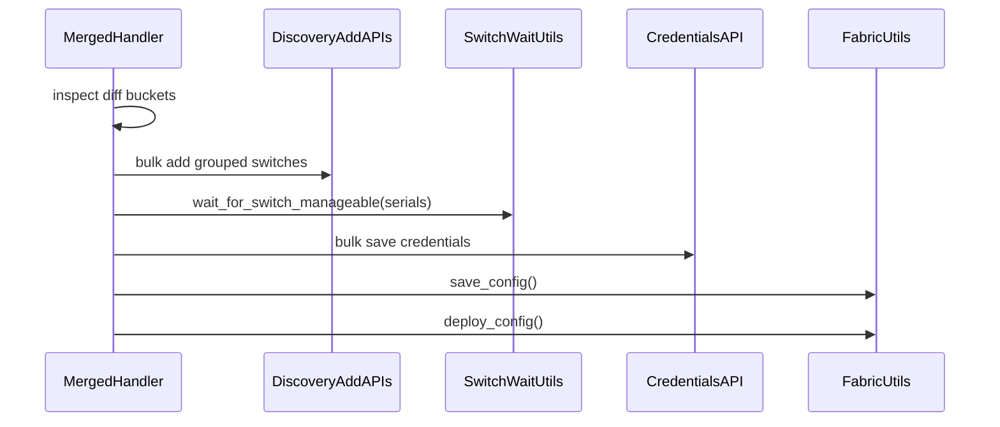

## 12.2 Overridden Update Scenario

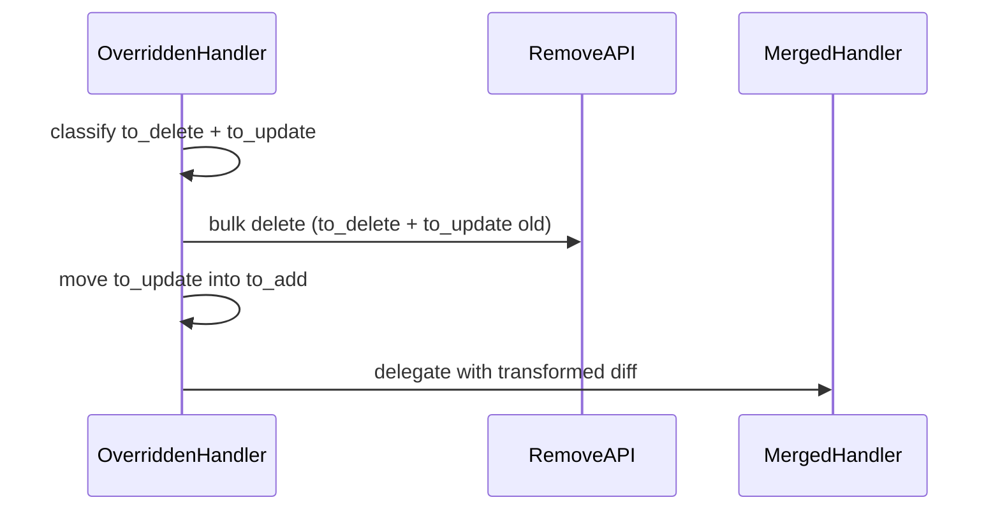

## 12.3 RMA Scenario

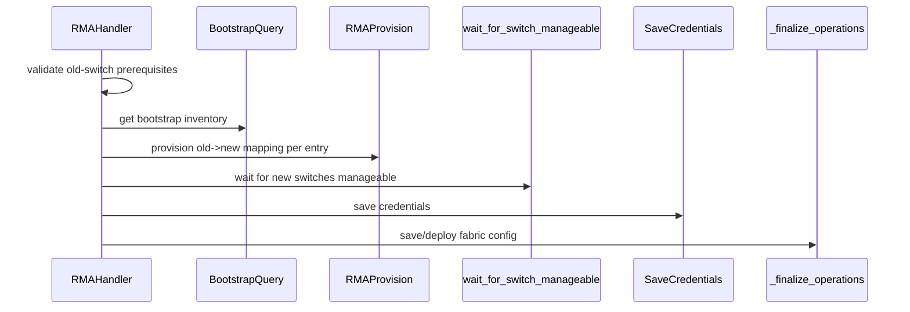

---

## 13. Architectural Strengths

- Clear separation of concerns (entrypoint vs orchestration vs utility services).
- Explicit state-machine routing and operation-type short-circuiting.
- Typed schema model usage for payload correctness and validation.
- Batch-oriented operations (group by credentials, bulk APIs) for efficiency.
- Multi-phase readiness workflow aligned with real switch lifecycle transitions.
- Incremental result registration enabling transparent operational audit.

---

## 14. Known Tradeoffs and Improvement Opportunities

1. Result action semantics:
   - Multiple sub-actions are registered, but top-level summarization can still appear coarse; consider richer operation timelines.

2. Merge vs update behavior:
   - `merged` warns for updates but does not apply them, which is correct semantically but can surprise users; consider explicit suggestion in result payload.

3. Best-effort sections:
   - Credential save failures are warnings; consider optional strict mode to fail-fast.

4. Duplicate documentation blocks in module docstring:
   - `rma` suboptions appear to contain overlapping/duplicated sections; cleanup would improve maintainability.

5. Fabric save/deploy policy:
   - Currently always called from finalize when flags are set; future optimization could conditionally skip when no controller-side mutation occurred.

---

## 15. Practical State Handling Summary

| State | Config Required | Discovery Path | Diff Used | Mutations | Finalize Save/Deploy |
|---|---:|---|---|---|---|
| `query` | No | No (inventory only) | No | No | No |
| `deleted` | No | No (inventory match only) | No | Delete APIs | No |
| `merged` | Yes | Yes (unless POAP/RMA mode) | Yes | Add APIs (+ migration processing) | Yes |
| `overridden` | Yes | Yes (unless POAP/RMA mode) | Yes | Delete + Add | Yes |

Special operation types when state is `merged`/`query` compatible config:

- `poap`: specialized bootstrap/preprovision APIs, bypass normal diff pipeline.
- `rma`: specialized replacement APIs with strict prerequisite checks, bypass normal diff pipeline.

---

## 16. File Mapping

- Core orchestrator: `plugins/module_utils/nd_switch_resources_v2.py`
- Utility services: `plugins/module_utils/switch_utils.py`
- Ansible module entry and argument spec: `plugins/modules/nd_manage_switches.py`

---

## 17. Appendix: Quick Mental Model

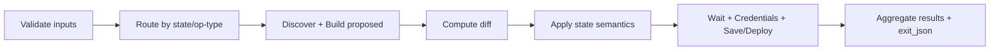

This module behaves as a deterministic orchestrator: validate, classify, execute bulk operations, converge switch readiness, and emit structured operational telemetry.

---

## 18. Playbook Usage Patterns and Internal Routing

This section maps concrete playbook task configurations to the module's internal routing and execution behavior.

### 18.1 Deleted State — Delete All Switches (No Config)

```yaml
- name: Wipe all switches from fabric
  cisco.nd.nd_manage_switches:
    fabric: AK-VXLAN
    state: deleted
```

**Internal routing**: `manage_state` → `self.config` is `None`/empty → `proposed_config = None` → `_handle_deleted_state(None)`.

**Behavior**: With no config block, `proposed_config` is `None`. The handler takes the `if proposed_config is None` branch and sets `switches_to_delete = list(self.existing)`, targeting every switch currently in the fabric. A single bulk delete API call removes all switches. No discovery, diff, or post-processing occurs.

**Key nuance**: This is a destructive operation. The entire fabric inventory is cleared. The `existing` list was populated from `_query_all_switches()` during `__init__`, so it reflects the fabric state at the time the module was invoked. Check mode is fully supported — it previews the list of switches that would be deleted without making any API calls.

### 18.2 Deleted State — Selective Delete (With Config)

```yaml
- name: Remove one switch
  cisco.nd.nd_manage_switches:
    fabric: AK-VXLAN
    state: deleted
    config:
      - seed_ip: 10.122.84.59
```

**Internal routing**: `manage_state` → `_validate_configs(self.config)` → `_handle_deleted_state(proposed_config)`.

**Behavior**: Each config entry's `seed_ip` is matched against existing switches by `fabric_management_ip`. Only matches are deleted. Non-matching entries are silently skipped (logged). The delete call is still a single bulk API request with all matched serial numbers.

### 18.3 Overridden State — Full Fabric Reconciliation

```yaml
- name: Add Switch to Fabric
  cisco.nd.nd_manage_switches:
    fabric: AK-VXLAN
    state: overridden
    config:
      - seed_ip: 10.122.84.59
        user_name: admin
        password: idgeR09!
        role: spine
        preserve_config: false
```

**Internal routing**: `manage_state` → `_validate_configs` → operation type `normal` → `_discover_switches` → `_build_proposed_from_discovery` → `_compute_changes` → `_handle_overridden_state`.

**Behavior**: The overridden handler compares the full proposed set (one switch at `10.122.84.59`) against all switches currently in fabric `AK-VXLAN`. Switches in the fabric that are **not** in the config list are deleted (`to_delete`). Switches that exist but differ in controllable fields are re-added (`to_update` converted to delete-then-add). Finally, the merged handler runs for additions and migration processing.

**Key nuance**: Because the config declares only one switch, **every other switch in the fabric will be deleted**. This is the intended semantic — overridden enforces the config as the complete desired state.

### 18.4 RMA Operation — Switch Replacement

```yaml
- name: RMA switch Configuration
  cisco.nd.nd_manage_switches:
    fabric: AK-VXLAN
    state: merged
    config:
      - seed_ip: 10.122.84.59
        user_name: admin
        password: idgeR09!
        role: leaf
        rma:
          - serial_number: 9YW7T47Y6M7
            old_serial: 982YGMKUY2B
            model: 'N9K-C9500v'
            version: '10.4(1)'
            config_data:
              models: [N9K-X9364v, N9K-vSUP]
              gateway: 10.122.84.1/24
```

**Internal routing**: `manage_state` → `_validate_configs` → operation type `rma` → `_handle_rma_state` (bypasses normal discovery/diff pipeline).

**Behavior**:
1. Validates prerequisites: old serial `982YGMKUY2B` must exist in fabric, must be `unreachable`, and must be in `maintenance` mode.
2. Queries bootstrap inventory to locate the new serial `9YW7T47Y6M7`.
3. Builds `RMASwitchModel` mapping old → new with supplied `config_data` (line cards, gateway).
4. Provisions the replacement via RMA API.
5. Runs **full** wait sequence (all 6 phases, including reload detection) — replacement switches always boot fresh, so `all_preserve_config` is never applied to RMA.
6. Saves credentials and finalizes fabric config.

**Key nuance**: The `rma` sub-option is nested under the parent switch config entry. The parent-level `seed_ip`, `user_name`, `password`, and `role` provide authentication context and the fabric endpoint, while the `rma` list carries the replacement-specific parameters.

### 18.5 Normal Merged — Multi-Switch Batch

```yaml
- name: Manage Switches
  cisco.nd.nd_manage_switches:
    fabric: AK-VXLAN
    state: merged
    config:
      - seed_ip: 10.122.84.59
        user_name: admin
        password: idgeR09!
        role: leaf
        preserve_config: false
      - seed_ip: 10.122.84.201
        user_name: admin
        password: idgeR09!
        role: leaf
        preserve_config: false
```

**Internal routing**: `manage_state` → `_validate_configs` → operation type `normal` → `_discover_switches` → `_build_proposed_from_discovery` → `_compute_changes` → `_handle_merged_state`.

**Behavior**:
1. Groups switches by shared credentials (here both share the same username/password, so they form one credential group).
2. Bulk-discovers both seed IPs as a single API call.
3. Builds proposed models by merging playbook intent (role, preserve_config) with discovery response (serial, hostname, model).
4. Diffs against existing fabric inventory to classify into `to_add`, `to_update`, `migration_mode`, `idempotent`.
5. For `to_add`: bulk-adds grouped by credentials.
6. Waits for manageability — since both switches have `preserve_config: false` (greenfield), the full 6-phase wait runs including reload detection.
7. Saves credentials and finalizes.

**Key nuance**: If both switches had `preserve_config: true` instead, the brownfield optimisation (Section 8.1) would short-circuit the wait after system mode normalisation, avoiding the ~25-minute reload detection timeout.

### 18.6 Routing Decision Summary

The module determines the operation type from the **structure** of the config entries, not from an explicit parameter:

| Config shape | Operation type | Handler |
|---|---|---|
| Entry with `rma` sub-option | `rma` | `_handle_rma_state` |
| Entry with `poap` sub-option | `poap` | `_handle_poap_state` |
| Entry with neither | `normal` | Discovery → diff → `_handle_merged_state` or `_handle_overridden_state` |

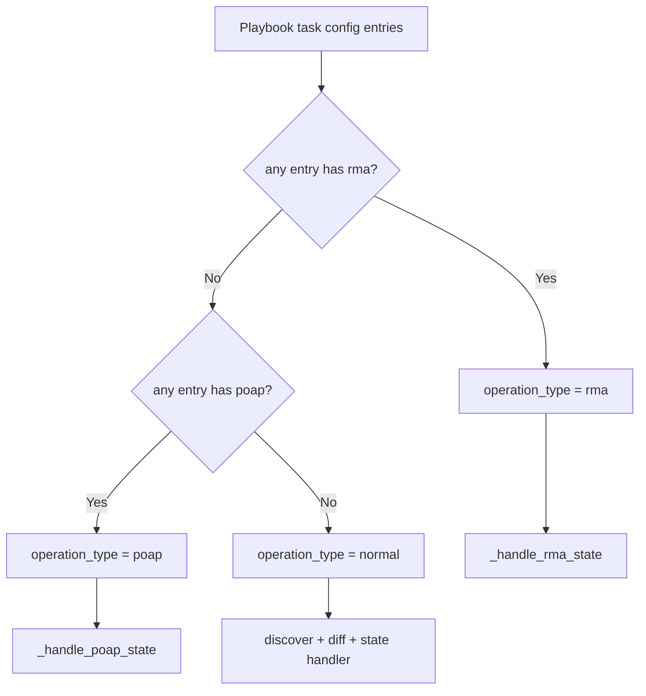

### 18.7 Credential Grouping Illustration

When multiple switches share the same credentials, the module groups them for efficient bulk API calls:

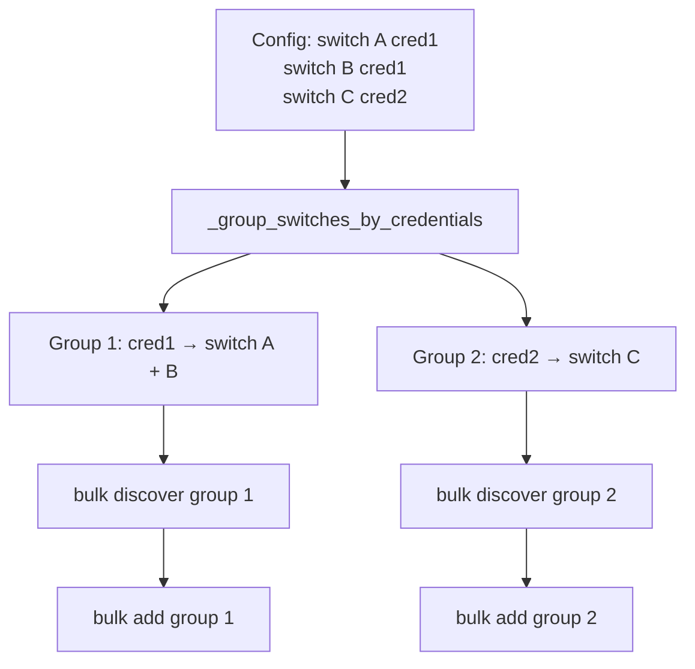

In the multi-switch example above (Section 18.5), both switches use identical credentials, resulting in a single credential group and a single bulk discovery + add cycle.
